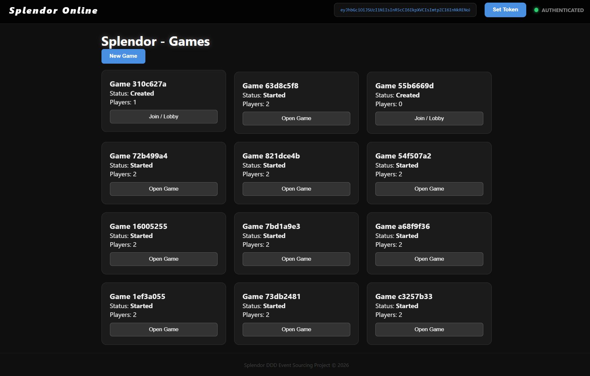
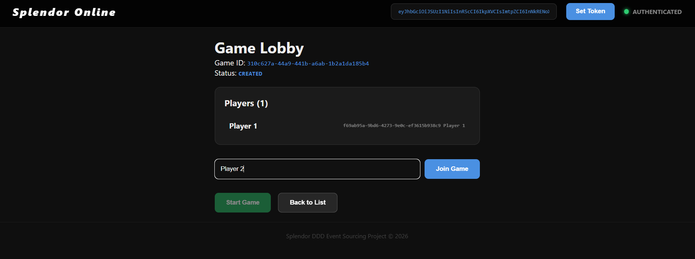
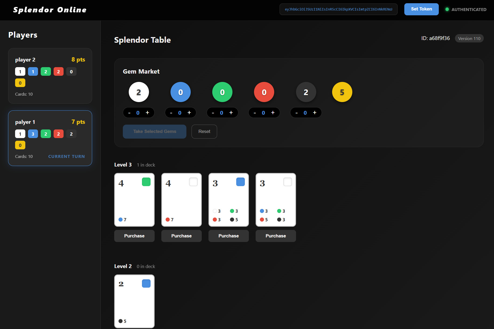

# SplendorOnlineGame

**SplendorOnlineGame** is a full-stack implementation of the popular board game Splendor, featuring a **.NET** backend and **Angular** frontend. Built as a practical showcase of **Domain-Driven Design (DDD)**, **Event Sourcing**, and **CQRS**.

> [!NOTE]
> **Status:** Work in progress – the project starts with a minimal, playable rule set and evolves incrementally.

## Demo

### Games List


### Game Lobby


### Gameplay


## Project Goals & Context

This project was created for **educational purposes** to gain hands-on experience with production-grade architectural patterns. The primary focus was to build a functional system that integrates:
- **Domain-Driven Design (DDD)** concepts.
- **Event Sourcing** for reliable state management.
- **CQRS** to decouple complex business logic from read-optimized data.
- **Entity Framework Core** for relational data access on the query side.

## Roadmap

This project is designed to evolve into a full-scale board game arena:
- **[x] User Management**: JWT authentication via Auth0.
- **[x] Web Frontend**: Angular SPA with game UI, lobby, and real-time updates (SignalR + RabbitMQ).
- **[ ] Player Profiles**: Statistics, rankings, and game history across different titles.
- **[ ] Multiple Game Support**: Leveraging the event-sourced core to add new games (e.g., Azul, 7 Wonders) alongside the initial Splendor implementation.
- **[ ] Matchmaking**: Join queues and game lobbies.

### AI-Powered Development
This project was developed in a **Pair Programming** session with **AI Agents**. It serves as a showcase of how AI can assist in architectural design, debugging complex environments (Docker/Testcontainers), and implementing robust boilerplate following industry best practices.

## Architecture & Methodologies

This project is built following **Clean Architecture** principles and leverages advanced messaging and persistence patterns:

### 1. Event Sourcing
The primary source of truth for the game state is an **Event Stream**. Every action (creating a game, joining, taking gems) is recorded as a sequence of immutable events.
- **Persistence**: Powered by [Marten](https://martendb.io/) on top of **PostgreSQL**.
- **Benefits**: Perfect audit log, ability to rebuild state at any point in time, and simplified write logic.

### 2. CQRS (Command Query Responsibility Segregation)
We separate the "write" side from the "read" side to optimize performance and scalability:
- **Commands**: Handled via **MediatR**. They validate business logic against the aggregate and persist events to Marten.
- **Queries**: Read models are decoupled from the event store.
- **Projections**: Marten projections asynchronously (or inline) update the **SQL Server** read models.

### 3. Real-time Read Models
While the write side uses PostgreSQL, the query side uses **SQL Server** via **Entity Framework Core**.
- This allows for complex querying and reporting without impacting the event store's performance.

### 4. Real-time Updates with RabbitMQ + SignalR
The application uses an event-driven architecture for real-time game updates:
- **Marten Subscriptions** listen for domain events and publish messages to RabbitMQ.
- **MassTransit** provides the messaging abstraction over RabbitMQ.
- **SignalR** pushes game state updates to connected clients via WebSocket.
- Players see opponent actions instantly without polling.

```
Domain Event → Marten Subscription → RabbitMQ → Consumer → SignalR Hub → WebSocket → Angular
```

### 5. Integration Testing with Testcontainers
Reliability is ensured through integration tests that use real database instances:
- **Testcontainers** automatically starts ephemeral Docker containers (PostgreSQL & SQL Server) for each test run.
- **WebApplicationFactory** provides in-memory API testing, ensuring the entire stack (Controller -> MediatR -> Marten -> SQL Server) works as expected.

## Getting Started

### Prerequisites
- .NET 6 SDK
- Node.js 18+ and npm
- Docker Desktop (for running the services and integration tests)

### Running Locally

1. **Start infrastructure** (PostgreSQL, SQL Server & RabbitMQ):
   ```bash
   docker-compose up -d
   ```
   - RabbitMQ Management UI: http://localhost:15672 (guest/guest)

2. **Run the API**:
   ```bash
   dotnet run --project Splendor.Api
   ```
   Access Swagger UI at `http://localhost:5081/swagger`.

3. **Run the Frontend**:
   ```bash
   cd Splendor.Web
   npm install
   ng serve
   ```
   Access the app at `http://localhost:4200`.

### Running Tests
To run the full suite of integration tests:
```bash
dotnet test
```

## Tech Stack
- **Frontend**: Angular 16 (standalone components)
- **Backend**: ASP.NET Core 6, Swagger/OpenAPI
- **Authentication**: JWT (Auth0)
- **CQRS**: MediatR
- **Event Store**: Marten (PostgreSQL)
- **Read Models**: EF Core (SQL Server)
- **Real-time**: SignalR, MassTransit, RabbitMQ
- **Testing**: xUnit, Testcontainers, FluentAssertions
