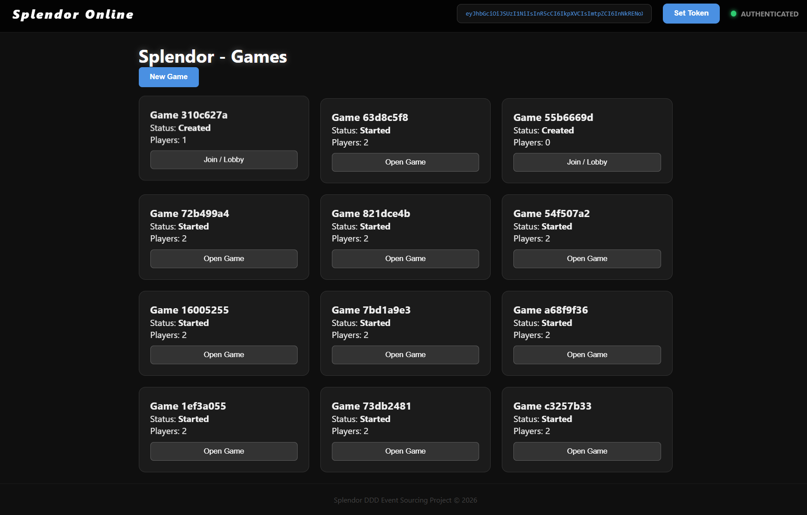
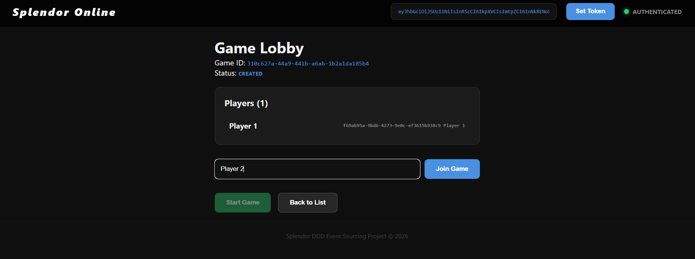
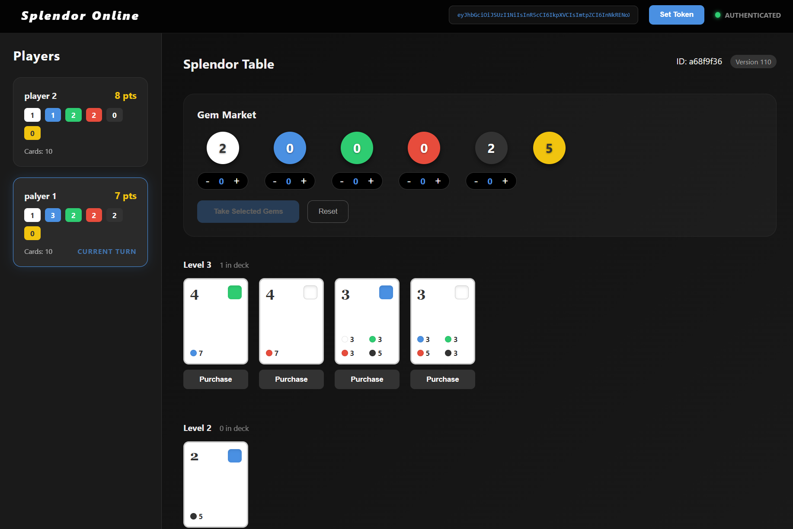

# SplendorOnlineGame

**SplendorOnlineGame** is a full-stack implementation of the popular board game Splendor, featuring a **.NET** backend and **Angular** frontend. Built as a practical showcase of **Domain-Driven Design (DDD)**, **Event Sourcing**, and **CQRS**.

> [!NOTE]
> **Status:** Playable Splendor implementation with a complete core ruleset. The wider game platform remains under active development.

## Demo

### Games List


### Game Lobby


### Gameplay


## Project Goals & Context

This project was created for **educational purposes** to gain hands-on experience with production-grade architectural patterns. The primary focus was to build a functional system that integrates:
- **Domain-Driven Design (DDD)** concepts.
- **Event Sourcing** for reliable state management.
- **CQRS** to decouple complex business logic from read-optimized data.
- **Marten document projections** for read-optimized game views.

## Roadmap

This project is designed to evolve into a full-scale board game arena:
- **[x] User Management**: JWT authentication via Auth0.
- **[x] Web Frontend**: Angular SPA with game UI, lobby, and real-time updates (SignalR + RabbitMQ).
- **[x] Bot Player Worker**: An autonomous, API-driven client that can join invited games and play turns through the same REST API as human players.
- **[ ] Player Profiles**: Statistics, rankings, and game history across different titles.
- **[ ] Multiple Game Support**: Leveraging the event-sourced core to add new games (e.g., Azul, 7 Wonders) alongside the initial Splendor implementation.
- **[ ] Matchmaking**: Join queues and game lobbies.

### AI-Assisted Development
AI coding agents were used as development assistants throughout the project, particularly for exploring implementation approaches, debugging, test development and repetitive coding tasks. Architectural decisions, domain modeling and final implementation choices were reviewed and validated manually.

## Architecture & Methodologies

This project is built following **Clean Architecture** principles and leverages advanced messaging and persistence patterns:

### 1. Event Sourcing
The primary source of truth for the game state is an **Event Stream**. Every action (creating a game, joining, taking gems) is recorded as a sequence of immutable events.
- **Persistence**: Powered by [Marten](https://martendb.io/) on top of **PostgreSQL**.
- **Benefits**: Perfect audit log, ability to rebuild state at any point in time, and simplified write logic.

### 2. CQRS (Command Query Responsibility Segregation)
We separate the "write" side from the "read" side to optimize performance and scalability:
- **Commands**: Handled via **MediatR**. They validate business logic against Marten decision state and domain rules, then persist events to Marten.
- **Queries**: Read optimized Marten documents.
- **Projections**: Marten inline projections update `GameSummaryView` and `SplendorBoardView`.

### 3. Real-time Read Models
The application keeps read models in PostgreSQL as Marten documents.
- This keeps event streams and query documents in one persistence stack while preserving CQRS boundaries.

### 4. Real-time Updates with RabbitMQ + SignalR
The application uses an event-driven architecture for real-time game updates:
- **Marten Subscriptions** listen for domain events and publish messages to RabbitMQ.
- **MassTransit** provides the messaging abstraction over RabbitMQ.
- **SignalR** pushes game state updates to connected clients via WebSocket.
- Players see opponent actions instantly without polling.

The bot worker is an autonomous API client, not an in-process game engine. It authenticates as a regular user, consumes game-update messages, reads the current game view through the REST API, and submits the same legal actions available to human players.

```
Domain Event → Marten Subscription → RabbitMQ
                                       ├→ SignalR consumer → WebSocket → Angular
                                       └→ Bot worker → REST API → Game command
```

### 5. Integration Testing with Testcontainers
Reliability is ensured through integration tests that use real database instances:
- **Testcontainers** automatically starts ephemeral PostgreSQL containers for integration tests.
- **WebApplicationFactory** provides in-memory API testing, ensuring the stack (Controller -> MediatR -> Marten) works as expected.

## Getting Started

### Prerequisites
- .NET 10 SDK
- Node.js 18+ and npm
- Docker Desktop (for running the services and integration tests)

### Running Locally

1. **Start infrastructure** (PostgreSQL & RabbitMQ):
   ```bash
   docker-compose up -d
   ```
   - RabbitMQ Management UI: http://localhost:15672 (guest/guest)

2. **Run the API**:
   ```bash
   dotnet run --project Splendor.Api
   ```
   Access Swagger UI at `http://localhost:5081/swagger`.

3. **Run the bot worker** (optional):
   ```bash
   dotnet run --project Splendor.BotWorker
   ```
   The worker requires API, RabbitMQ, and Auth0 configuration. It writes logs to the console and `Splendor.BotWorker/logs/`.

4. **Run the Frontend**:
   ```bash
   cd Splendor.Web
   npm install
   ng serve
   ```
   Access the app at `http://localhost:4200`.

### Running Tests

**Unit tests**:
```bash
dotnet test Splendor.UnitTests
```

**Integration tests** (requires Docker):
```bash
dotnet test Splendor.IntegrationTests
```

**UI tests** (requires Chrome, running API and frontend):
```bash
# Terminal 1
dotnet run --project Splendor.Api --launch-profile Testing

# Terminal 2
cd Splendor.Web && ng serve

# Terminal 3
dotnet test Splendor.UITests
```

## Tech Stack
- **Frontend**: Angular 16 (standalone components)
- **Backend**: ASP.NET Core 10, Swagger/OpenAPI
- **Authentication**: JWT (Auth0)
- **CQRS**: MediatR
- **Event Store**: Marten (PostgreSQL)
- **Read Models**: Marten documents (PostgreSQL)
- **Real-time**: SignalR, MassTransit, RabbitMQ
- **Testing**: xUnit unit tests, Testcontainers, FluentAssertions, Selenium (E2E)
